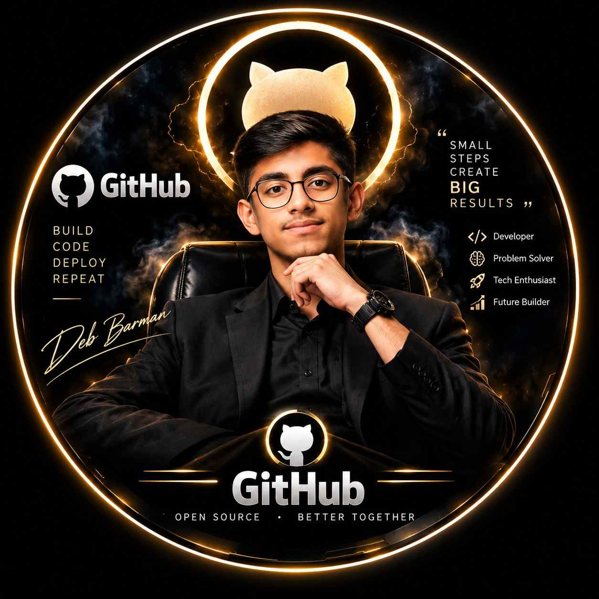
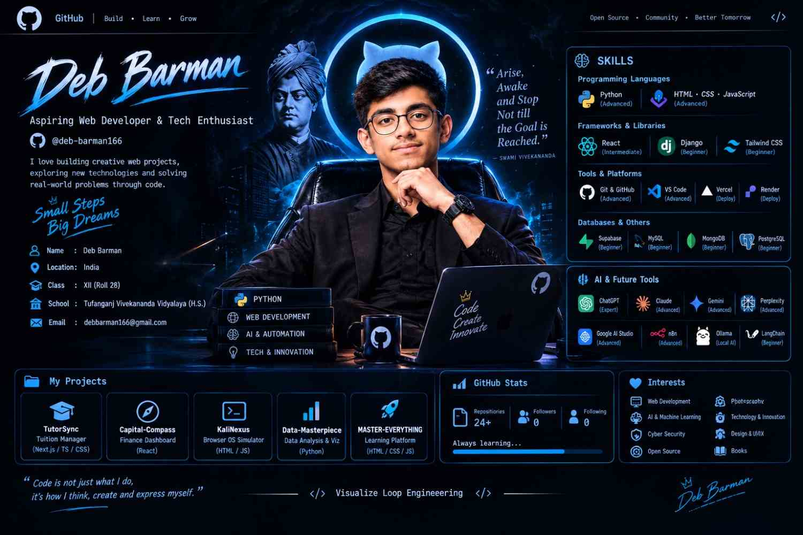
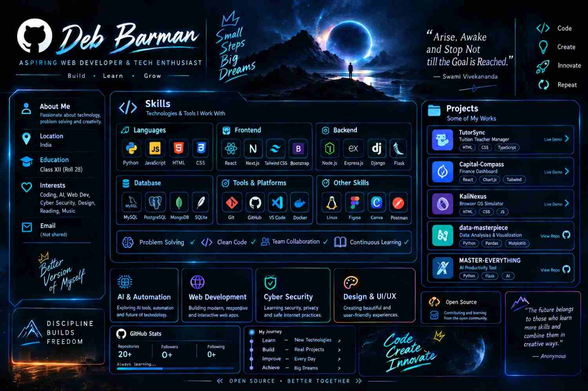

<!-- ═══════════════════════════════════════════════════════════════
     DEB BARMAN · GitHub Profile README  (Deb-Barman/Deb-Barman)
     Folder layout:
       README.md
       public/profile_img.jpeg
       public/profile_details.jpeg
       public/project_and_skills.jpeg
     ═══════════════════════════════════════════════════════════════ -->


<div align="center">

<a href="https://github.com/Deb-Barman">
  
</a>

<br/>

<a href="https://github.com/Deb-Barman">
  
</a>

<br/>


</div>

<br/>

<div align="center">
  
</div>

---

## ⚡ About Me

<table>
<tr>
<td width="62%" valign="top">

```js
const deb = {
  name:      "Deb Barman",
  role:      "Aspiring Web Developer & Tech Enthusiast",
  location:  "India 🇮🇳",
  school:    "Tufanganj Vivekananda Vidyalaya (H.S.)",
  languages: ["English", "বাংলা"],
  interests: ["Coding", "AI", "Web Dev", "Cyber Security", "Design", "Reading", "Music"],
  motto:     "Discipline Builds Freedom",
  mission:   "Better Version of Myself",
};
```

Passionate about technology, problem solving and creativity — I build, learn and improve every single day.

</td>
<td width="38%" valign="middle" align="center">

> *"Arise, Awake and Stop not till the goal is reached."*
>
> — **Swami Vivekananda**

</td>
</tr>
</table>

---

## 🧠 Skills & Projects — At a Glance

<div align="center">
  
</div>

---

## 🛠️ Tech Arsenal

### 💻 Languages


### 🎨 Frontend


### ⚙️ Backend


### 🗄️ Databases


### 🚀 Tools & Platforms


### ✨ Other Skills


> ✅ **Problem Solving** &nbsp;·&nbsp; ✅ **Clean Code** &nbsp;·&nbsp; ✅ **Team Collaboration** &nbsp;·&nbsp; ✅ **Continuous Learning**

---

## 🔥 Focus Areas

<table>
<tr>
<td align="center" width="25%">
<h3>🤖 AI & Automation</h3>
<sub>Exploring AI tools, automation and the future of technology.</sub>
</td>
<td align="center" width="25%">
<h3>🌐 Web Development</h3>
<sub>Building modern, responsive and interactive web apps.</sub>
</td>
<td align="center" width="25%">
<h3>🛡️ Cyber Security</h3>
<sub>Learning security, privacy and safe internet practices.</sub>
</td>
<td align="center" width="25%">
<h3>🎨 Design & UI/UX</h3>
<sub>Creating beautiful and user-friendly experiences.</sub>
</td>
</tr>
</table>

---

## 📂 Featured Projects

<table>
<tr>
<td align="center" width="20%">
<a href="https://github.com/Deb-Barman/TutorSync">
<h3>🎓 TutorSync</h3>
</a>
<sub><b>Tuition Teacher Manager</b></sub>
<br/><br/>


</td>
<td align="center" width="20%">
<a href="https://github.com/Deb-Barman/Capital-Compass">
<h3>🧭 Capital-Compass</h3>
</a>
<sub><b>Finance Dashboard</b></sub>
<br/><br/>


</td>
<td align="center" width="20%">
<a href="https://github.com/Deb-Barman/KaliNexus">
<h3>💻 KaliNexus</h3>
</a>
<sub><b>Browser OS Simulator</b></sub>
<br/><br/>


</td>
<td align="center" width="20%">
<a href="https://github.com/Deb-Barman/data-masterpiece">
<h3>📊 data-masterpiece</h3>
</a>
<sub><b>Data Analysis &amp; Visualization</b></sub>
<br/><br/>


</td>
<td align="center" width="20%">
<a href="https://github.com/Deb-Barman/MASTER-EVERYTHING">
<h3>🚀 MASTER-EVERYTHING</h3>
</a>
<sub><b>AI Productivity Tool</b></sub>
<br/><br/>


</td>
</tr>
</table>

<div align="center">

[](https://github.com/Deb-Barman?tab=repositories)

</div>

---

## 🛤️ My Journey

```text
  Learn    ──►  New Technologies
  Build    ──►  Real Projects
  Improve  ──►  Every Day
  Achieve  ──►  Big Dreams
```

---

## 📊 GitHub Analytics

<div align="center">


<br/>


<br/><br/>


</div>

---

## 🏆 Trophies

<div align="center">

[](https://github.com/ryo-ma/github-profile-trophy)

</div>

---

## 🎯 Interests

<div align="center">


</div>

---

## 🤝 Let's Connect

<div align="center">

[](https://github.com/Deb-Barman)

</div>

---

<div align="center">

### 💬 *"The future belongs to those who learn more skills and combine them in creative ways."*

<br/>

**Discipline Builds Freedom &nbsp;•&nbsp; Open Source &nbsp;•&nbsp; Better Together**

<br/>


</div>
